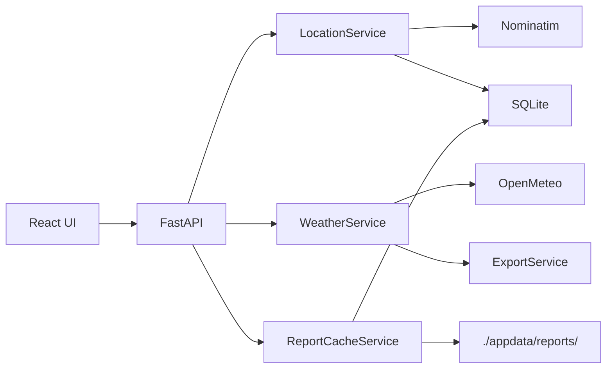

# Weather

Desktop app for searching locations, generating historical weather data, and exporting it as `.wea` files. The UI is a React app served by a FastAPI backend and wrapped in a native window with pywebview.

## Features

- **Location search** — find places via OpenStreetMap (Nominatim)
- **Saved locations** — persist, select, delete, or manually add locations with custom coordinates
- **Weather export** — fetch daily weather for a date range and write a `.wea` file to a chosen folder
- **Local report cache** — optionally save generated reports locally with location and date metadata
- **Re-save reports** — export a cached report to a new folder via the system folder picker

## Tech stack

| Layer | Stack |
|-------|-------|
| Backend | Python, FastAPI, Pydantic, pandas, SQLite |
| Frontend | React 19, TypeScript, Vite |
| Desktop | pywebview, uvicorn |
| External data | [Open-Meteo Archive API](https://open-meteo.com/), [Nominatim](https://nominatim.org/) |

## Project structure

```
Weather/
├── main.py                 # Desktop entry point (pywebview + uvicorn)
├── main.spec               # PyInstaller config
├── backend/
│   ├── app.py              # FastAPI routes and static file serving
│   ├── container/          # Dependency injection
│   ├── dto/                  # Request/response models
│   ├── model/                # Domain models
│   ├── services/             # Business logic
│   └── tests/                # pytest service tests
└── frontend/
    ├── src/
    │   ├── components/       # UI components
    │   ├── lib/api/          # HTTP client
    │   ├── lib/dto/          # TypeScript interfaces
    │   ├── pages/            # Page composition
    │   └── states/           # Reactive state objects
    └── dist/                 # Production build (generated)
```

## Prerequisites

- Python 3.12+
- Node.js 20+
- npm

## Setup

### Backend

```bash
python -m venv .venv

# Windows
.venv\Scripts\activate

# macOS / Linux
source .venv/bin/activate

pip install -r backend/requirements.txt
```

### Frontend

```bash
cd frontend
npm install
```

## Development

Run the backend and frontend in separate terminals from the repository root.

**Backend** (port 8000):

```bash
uvicorn backend.app:app --reload --port 8000
```

**Frontend** (port 5173, proxies `/api` to the backend):

```bash
cd frontend
npm run dev
```

Open http://localhost:5173 in a browser.

### Desktop mode

Build the frontend first, then launch the desktop shell:

```bash
cd frontend
npm run build
cd ..
python main.py
```

This starts the API on a free local port and opens it in a native window.

## Production build

```bash
cd frontend
npm run build
cd ..
pyinstaller main.spec
```

The executable is written to `dist/main.exe` (Windows) or `dist/main` (macOS/Linux). It bundles the built frontend from `frontend/dist/`.

## Tests

From the repository root:

```bash
python -m pytest backend/tests
```

Tests cover backend services with pytest and mocks. There are no frontend UI tests.

### Linting

```bash
cd frontend
npm run lint
```

## Local data

Application data is stored relative to the working directory:

| Path | Purpose |
|------|---------|
| `./appdata/locations.db` | SQLite database for saved locations and cached report metadata |
| `./appdata/reports/` | Cached `.wea` report files |

## API

All routes are prefixed with `/api`.

| Method | Path | Description |
|--------|------|-------------|
| GET | `/api/locations` | Search locations (`?name=`) |
| GET | `/api/weather/locations` | List saved locations |
| POST | `/api/weather/locations` | Save a location |
| DELETE | `/api/weather/locations/{id}` | Delete a saved location |
| POST | `/api/folders/select` | Open folder picker for export |
| GET | `/api/folders/selected` | Get current export folder |
| GET | `/api/weather` | Generate weather data (query: lat, lon, from_date, to_date, report_name, save_to_cache, location_name) |
| GET | `/api/weather/reports` | List cached reports |
| DELETE | `/api/weather/reports/{report_name}` | Delete a cached report |
| POST | `/api/weather/reports/{report_name}/export` | Re-save a cached report to a new folder |

## Output format

Weather data is exported as `.wea` files: one comma-separated line per day with month, day, year, precipitation, ET₀, temperature, wind speed, and radiation. Unit conversions are applied server-side before export.

Report names are sanitized into file names (for example, `My Report` → `My_Report.wea`).

## Architecture


